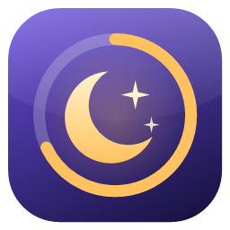

<p align="center"></p>

<h1 align="center">Extra Dim</h1>

<p align="center">Make your Windows screen darker than its lowest brightness.<br>
A tiny, offline app with a floating moon bubble to switch it on and off.</p>

<p align="center"><a href="https://github.com/LawalGoodness/extra-dim/releases/latest"><b>⬇ Download the latest version</b></a></p>
<p align="center"><sub>or from <a href="https://drive.google.com/file/d/11R0qiEpG4DOZplvojKykBGNhu2qfZQPk/view?usp=sharing">Google Drive</a></sub></p>

---

## Download and run

1. Open the [latest release](https://github.com/LawalGoodness/extra-dim/releases/latest) (or the [Google Drive copy](https://drive.google.com/file/d/11R0qiEpG4DOZplvojKykBGNhu2qfZQPk/view?usp=sharing)) and download **`ExtraDim.exe`**.
2. Double-click it. There is nothing to install.
3. The first time, Windows may say *"Windows protected your PC"*, because the app isn't signed with a paid
   certificate. Click **More info → Run anyway**.

It works on Windows 10 and 11 and never uses the internet. The only exception is the "Get the original" button in the tamper warning, which opens the official download in your browser.

## Using it

| Do this | To |
|---|---|
| **Click** the moon bubble | Turn dimming on / off |
| **Scroll** on the bubble | Make it darker / brighter |
| **Drag** the bubble | Move it anywhere |
| **Right-click** the bubble or tray icon | Levels, settings, start with Windows, exit |
| `Ctrl` + `Alt` + `D` | On / off |
| `Ctrl` + `Alt` + `=` / `−` | Darker / brighter |
| `Ctrl` + `Alt` + `B` | Show / hide the bubble |

- The bubble fades when you're not using it and brightens when you hover over it.
- Turn on **Tuck bubble into the screen edge when idle** and it slides half off the edge of the screen. Tap it to bring it back.
- Screenshots and screen-shares stay at normal brightness.
- Clicks pass straight through the dim layer to whatever is underneath.

## Tamper protection

Every official build is digitally signed. Each time it starts, Extra Dim checks itself against that signature.
If even one byte has changed (a virus that infects programs, a modified copy, a damaged download), it
refuses to run and points you to the original.

**Only download Extra Dim from this page or the Google Drive link above.** No check built into an app can stop a fake app that just uses the same name, so this page
is the one trustworthy source.

## Build it yourself

Everything compiles with the C# compiler that already ships with Windows. You don't need to install anything.

```powershell
powershell -ExecutionPolicy Bypass -File build.ps1
```

This creates `dist\ExtraDim.exe` and a desktop shortcut. The first build creates your own signing key in
`%USERPROFILE%\.extra-dim-signing\`. Keep it private, because anyone who has it can sign copies as yours.

---

<p align="center"><sub>Made by <a href="https://github.com/LawalGoodness">Lawal Goodness</a></sub></p>
